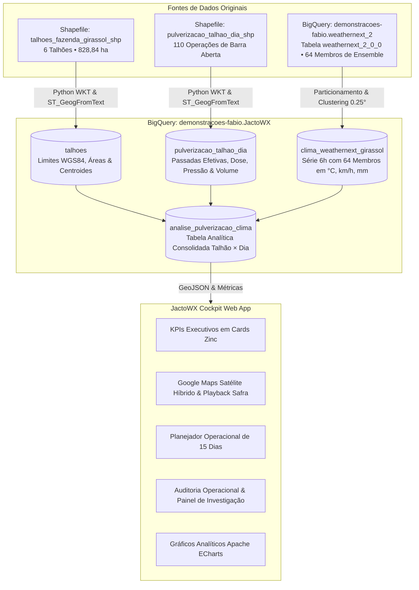

# JactoWX | Agronomic & Spraying Intelligence Cockpit

[](https://react.dev)
[](https://vitejs.dev)
[](https://cloud.google.com/bigquery)
[](https://cloud.google.com)
[](https://maps.google.com)
[](https://tailwindcss.com)
[](https://echarts.apache.org)

> **Cockpit Executivo de Agricultura de Precisão**: Integração dos dados geoespaciais e telemetria operacional de pulverizadores **Jacto** na **Fazenda Girassol (Itiquira / Rondonópolis - MT)** com o modelo probabilístico de Inteligência Artificial **Google WeatherNext 2 (64 membros de ensemble)** no **Google Cloud BigQuery**.

---

## 📌 Visão Geral do Projeto

No agronegócio de larga escala, os defensivos agrícolas representam de **25% a 35% do custo operacional da safra**. Pulverizar sob condições meteorológicas adversas gera prejuízos milionários decorrentes de:
* **Deriva** por ventos fortes (> 15 km/h);
* **Inversão térmica** por vento estagnado (< 3 km/h);
* **Evaporação precoce da gota** sob altas temperaturas (> 30°C/32°C);
* **Lavagem da calda** por chuvas repentinas (> 1mm a 5mm).

O **JactoWX** resolve esse desafio ao unir a **telemetria efetiva de barra aberta** das máquinas com a **IA meteorológica probabilística do Google**, transformando a gestão da proteção de lavouras em uma operação preditiva, com matriz de decisão para os próximos 15 dias e auditoria completa da safra 2025/2026.

---

## 🏗️ Arquitetura da Solução



---

## 🗄️ Estrutura do Dataset no BigQuery (`demonstracoes-fabio.JactoWX`)

| Tabela | Linhas | Período | Partição & Cluster | Descrição |
| :--- | :---: | :---: | :--- | :--- |
| **`talhoes`** | `6` | 2021 a 2200 | `CLUSTER BY id_field, talhao, geometria_talhao` | Limites poligonais (`GEOGRAPHY`), centroides e metadados cadastrais dos 6 talhões da Fazenda Girassol. |
| **`pulverizacao_talhao_dia`** | `110` | Set/25 a Jul/26 | `PARTITION BY DATE_TRUNC(data_operacao, MONTH)`<br>`CLUSTER BY id_field, talhao, geometria_pulverizacao` | Multipolígonos vetoriais das passadas efetivas com barra aberta, dose média (`L/ha`), volume (`L`), pressão (`PSI`) e área aplicada. |
| **`clima_weathernext_girassol`** | `3.144` | Set/25 a Out/26 | `PARTITION BY data_local_mt`<br>`CLUSTER BY id_celula_grade, status_janela_6h` | Série horária em fuso local de Mato Grosso (`02h`, `08h`, `14h`, `20h`) com média, percentis P10/P90 e probabilidades de risco calculadas nos 64 membros de ensemble do WeatherNext 2. |
| **`analise_pulverizacao_clima`** | `2.358` | Set/25 a Out/26 | `PARTITION BY DATE_TRUNC(data_calendario, MONTH)`<br>`CLUSTER BY id_field, talhao, houve_pulverizacao` | Tabela analítica consolidada (`Talhão × Dia`), cruzando operações, conformidade agronômica Jacto, horas de janela livre e previsão estendida de 15 dias. |

---

## 🎯 Regras de Ouro: Janela de Pulverização Jacto

O cockpit classifica automaticamente cada dia e turno operacional em 3 níveis:

* **🟢 IDEAL**:
  * **Vento (10m)**: `3,0 a 10,0 km/h`
  * **Temperatura (2m)**: `≤ 30,0 °C`
  * **Precipitação 24h**: `< 1,0 mm` (e prob. de chuva no ensemble `< 25%`)
  * *Ação*: Condição perfeita para aplicação foliar; máxima cobertura e absorção sem risco de deriva.
* **🟡 ALERTA**:
  * **Vento (10m)**: `10,0 a 15,0 km/h` (moderado) ou `< 3,0 km/h` (risco de inversão térmica)
  * **Temperatura (2m)**: `30,0 °C a 32,0 °C`
  * **Precipitação 24h**: `1,0 a 5,0 mm` (pancadas de chuva típicas de verão)
  * *Ação*: Aplicação permitida sob monitoramento rigoroso, uso de pontas de gotas médias/grossas ou priorizando turnos da manhã.
* **🔴 IMPRÓPRIA**:
  * **Vento (10m)**: `> 15,0 km/h` (alto risco de deriva)
  * **Temperatura (2m)**: `> 32,0 °C` (evaporação rápida e perda de produto)
  * **Precipitação 24h**: `> 5,0 mm` (risco de lavagem total da calda)
  * *Ação*: **Parar a máquina**. Pulverizar gera desperdício de insumos e passivo ambiental.

---

## 📊 Principais Descobertas na Fazenda Girassol

Ao auditar as **110 pulverizações realizadas** (`5.993,8 ha` e `392.070 L` de calda):
1. **63% das aplicações** ocorreram em janelas favoráveis ou sob alerta controlado.
2. Em dias classificados em 24h com alerta de chuva (48 operações), o cálculo de **Horas de Janela Ideal** identificou uma média de **8,8 horas limpas pela manhã/madrugada**, comprovando que os operadores aproveitaram janelas seguras antes das pancadas convectivas de fim de tarde.
3. Para o planejamento futuro de 15 dias, o dia **30 de setembro de 2026** apresenta **18 horas ideais livres** em todos os talhões (vento médio de 8,7 km/h e 27,2 °C), sendo a data ideal recomendada pelo sistema para aplicações de fungicidas.

---

## 💻 Como Executar a Aplicação Localmente

### Pré-requisitos:
* **Node.js** v18+ (testado no Node.js v24.15.0)
* **npm** v9+ (testado no npm 11.12.1)

### Passo a passo:

```bash
# 1. Clonar o repositório
git clone https://github.com/meneghimfabio/JactoWx.git
cd JactoWx/app

# 2. Instalar as dependências
npm install

# 3. Iniciar o servidor de desenvolvimento
npm run dev
```

Acesse o cockpit no navegador:
👉 **[http://localhost:3000](http://localhost:3000)**

---

## 📁 Estrutura de Arquivos do Repositório

```
JactoWx/
├── README.md                      # Documentação completa do projeto
├── MANUAL_EXECUTIVO.md            # Roteiro de pitch para apresentação a C-Levels
├── Instrucoes_Cliente             # Requisitos e contexto agronômico do cliente
├── talhoes_fazenda_girassol_shp/  # Shapefile com os 6 talhões cadastrais (WGS84)
├── pulverizacao_talhao_dia_shp/   # Shapefile das 110 operações efetivas de barra aberta
└── app/                           # Aplicação Web Frontend (React + Vite + Tailwind)
    ├── package.json               # Dependências (React 18, Leaflet, ECharts, Lucide)
    ├── vite.config.js             # Configuração do Vite
    ├── tailwind.config.js         # Tema Dark/Light com paleta Zinc
    ├── export_data_for_ui.py      # Pipeline de exportação do BigQuery para a UI
    ├── src/
    │   ├── App.jsx                # Componente principal do Cockpit
    │   ├── main.jsx               # Entrypoint React
    │   ├── index.css              # Estilos globais e customização de mapas
    │   ├── data/
    │   │   └── jacto_data.json    # Dados enriquecidos GeoJSON e métricas analíticas
    │   └── components/
    │       ├── Header.jsx         # Cabeçalho executivo, abas e alternância Dark/Light
    │       ├── KpiCards.jsx       # Cards de indicadores-chave com métricas Jacto
    │       ├── MapViewer.jsx      # Google Maps Satélite com playback da safra
    │       ├── ForecastPlanner.jsx# Matriz operacional e previsão de 15 dias
    │       ├── SprayingTable.jsx  # Tabela com painel de investigação lateral
    │       └── AnalyticsCharts.jsx# Gráficos de dispersão, cobertura e conformidade
```

---

## 📖 Material de Apoio Executivo
Para entender a fundo a lógica agronômica e conduzir uma apresentação de alto impacto para executivos e diretores do agronegócio, leia o [MANUAL_EXECUTIVO.md](MANUAL_EXECUTIVO.md).
